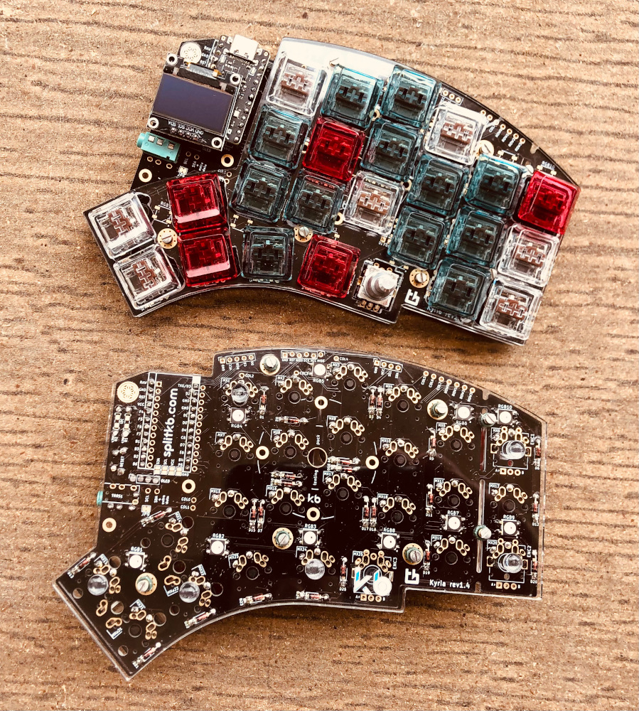
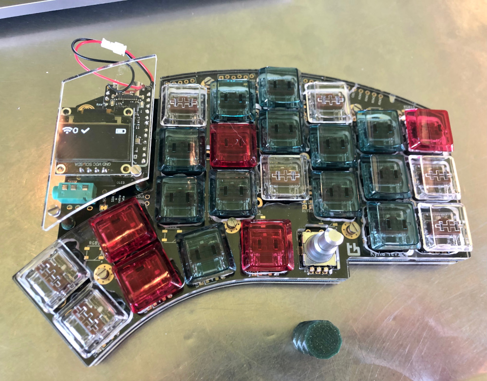

# ZMK Config

This is my personal keyboard config for my Kyria keyboard.

- wireless via a (pair of) [Nice Nano v2](https://nicekeyboards.com/nice-nano/)
- choc brown switches
- OLED screen
- 601235 battery with JST 1.5 (2 prong) connectors for easy battery swaps

